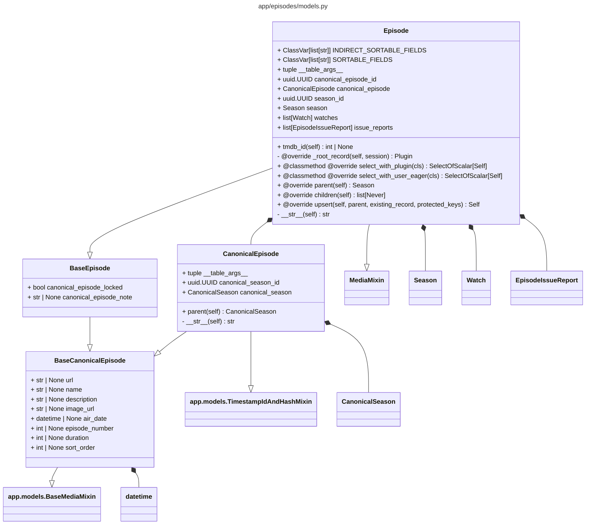

```mermaid
---
title: app/episodes/models.py
---
classDiagram
    class BaseCanonicalEpisode {
        + str | None url
        + str | None name
        + str | None description
        + str | None image_url
        + datetime | None air_date
        + int | None episode_number
        + int | None duration
        + int | None sort_order
    }

    class BaseEpisode {
        + bool canonical_episode_locked
        + str | None canonical_episode_note
    }

    class CanonicalEpisode {
        + tuple \_\_table_args__
        + uuid.UUID canonical_season_id
        + CanonicalSeason canonical_season
        + parent(self) CanonicalSeason
        - \_\_str__(self) str
    }

    class Episode {
        + ClassVar[list[str]] INDIRECT_SORTABLE_FIELDS
        + ClassVar[list[str]] SORTABLE_FIELDS
        + tuple \_\_table_args__
        + uuid.UUID canonical_episode_id
        + CanonicalEpisode canonical_episode
        + uuid.UUID season_id
        + Season season
        + list[Watch] watches
        + list[EpisodeIssueReport] issue_reports
        + tmdb_id(self) int | None
        - @override \_root_record(self, session) Plugin
        + @classmethod @override select_with_plugin(cls) SelectOfScalar[Self]
        + @classmethod @override select_with_user_eager(cls) SelectOfScalar[Self]
        + @override parent(self) Season
        + @override children(self) list[Never]
        + @override upsert(self, parent, existing_record, protected_keys) Self
        - \_\_str__(self) str
    }

    BaseCanonicalEpisode --|> app.models.BaseMediaMixin

    BaseEpisode --|> BaseCanonicalEpisode

    CanonicalEpisode --|> app.models.TimestampIdAndHashMixin

    CanonicalEpisode --|> BaseCanonicalEpisode

    Episode --|> BaseEpisode

    Episode --|> MediaMixin

    BaseCanonicalEpisode *-- datetime

    CanonicalEpisode *-- CanonicalSeason

    Episode *-- CanonicalEpisode

    Episode *-- Season

    Episode *-- Watch

    Episode *-- EpisodeIssueReport
```
